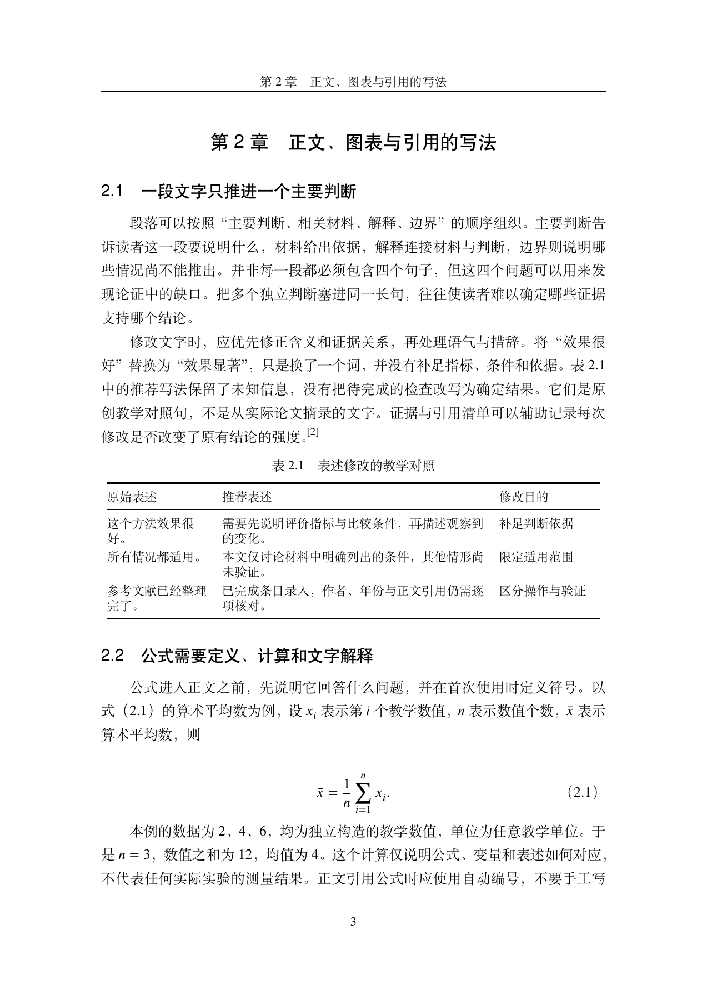
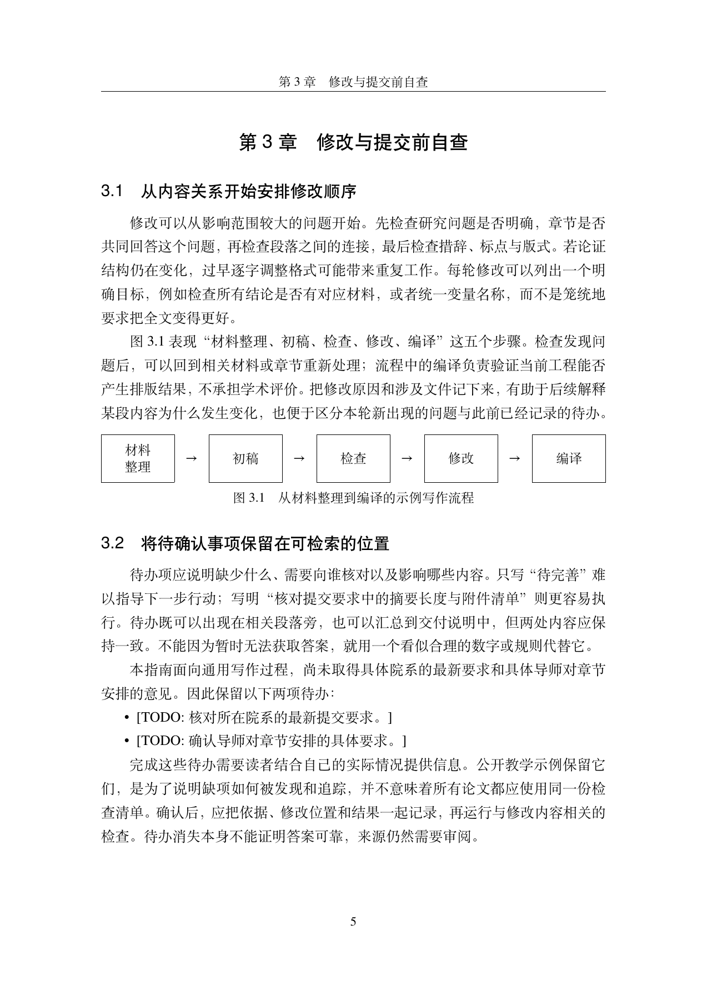

# A Guide to Thesis Writing and Self-Review

[中文](README.md) | English · [Original material](source.md) · [Agent prompt](prompt.md) · [Local validation](VALIDATION.md)

This original three-chapter teaching example demonstrates Markdown material, editable ThuThesis chapters, quality checks, and a real PDF build. It discusses chapter planning, equations and tables, citations, and checks before submission. It is general writing guidance, not an institution's official requirements or a submission-ready thesis.

The explanations, sentence pairs, tables, workflow figure, and two supporting notes were written for this project under its [MIT License](../../LICENSE). The illustrative values `2, 4, 6` have a mean of `4`; they are not real experimental measurements. Download the official ThuThesis template separately and retain its upstream license.

## Actual output

These previews are pages from the locally compiled PDF. See [VALIDATION.md](VALIDATION.md) for page numbers and the recorded checks.





## Generate with an Agent or replay the fixture

For a new Agent authoring run, follow [prompt.md](prompt.md), using the repository's `SKILL.md`, original source, and supporting notes. Wording may vary, but the values, references, and two TODOs must remain faithful. The first actual authoring run is recorded separately in [VALIDATION.md](VALIDATION.md).

The replay command below reconstructs the reviewed `expected/` fixture, then runs initialization, bibliography append, quality gates, and compilation using this repository's scripts. It does not invoke an Agent or measure new authoring performance.

## Local replay

Run from the repository root. Requirements: Python 3.9+, `latexmk`, XeLaTeX, BibTeX, and the TeX dependencies required by ThuThesis. This example uses Fandol CJK and companion TeX Gyre fonts. Template downloads require HTTPS; a local release ZIP supports offline initialization. Pandoc is not required for Markdown input.

```bash
python3 tools/run_example.py --output /tmp/thuthesis-example
```

The output directory must not exist. By default the command runs both cases:

- `cited`: the three-chapter guide cites the two original supporting notes, `guide1` and `guide2`.
- `no-citations`: a regression variant removes those citation commands while retaining `\bibliography` in the main file. It checks real compilation with `\bibdata` and zero citations; this variant is not the primary showcase.

Use a local official archive or select one case:

```bash
python3 tools/run_example.py \
  --output /tmp/thuthesis-example-offline \
  --source /path/to/thuthesis-v7.7.1.zip \
  --case cited
```

`--case` accepts `cited`, `no-citations`, or `all` (default). [template.json](template.json) fixes the release version, official URL, and SHA-256; local archives must pass the same checksum.

If fonts are missing, install `fandol`, `tex-gyre`, and `tex-gyre-math` using a repository matching your TeX Live year. With a matching repository already configured, use `tlmgr install fandol tex-gyre tex-gyre-math`. The example never installs or upgrades TeX automatically; compile reports retain the original diagnostic output.

## Outputs and interpretation

The output contains `result.json`, source extraction, recorded commands, and a directory for each case. Each case contains an editable `project/` with `main.pdf`, a pre-edit `baseline/`, and `reports/` covering quality, compilation, logs, and template preservation. Reports include input and runtime file hashes and local tool versions. `source_commit` is the repository HEAD at execution time; use the hashes to identify uncommitted inputs.

Success means top-level `ok=true`; both cases have `compile_ok=true`, `submission_ready=false`, and `todo_count=2`. The false readiness value is intentional: the latest departmental requirements and the supervisor's preferred chapter arrangement remain unconfirmed.

The example explicitly replaces upstream demonstration chapters and abstracts. Reports explain why comparing those old TeX structures is skipped; bibliography append preservation and other template-file checks remain active. Initializer-added notices remain in the upstream example pages, which the showcase main file does not include. Template core files are unchanged.

Existing output paths, checksum mismatches, missing tools, citation errors, or compile failures produce a nonzero exit. Failures after initialization retain the output and diagnostic reports; retry with a new directory. A change to inputs during replay also fails the run.

Only local validation is recorded. No CI workflow was added and Linux was not tested. The example is available in the repository; earlier Release assets do not contain these additions.
